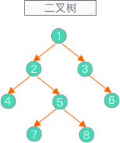

# 二叉树

## 树

树其实是不包含回路的连通[无向图](../../图/index.md)。

树有如下特性：

- 一颗树中任意两个结点有且仅有唯一的一条路径连通；
- 如果有 `n` 个结点，那么一定存在 `n-1` 条边；
- 在树中加一条边将会构成一个回路；

## 二叉树

二叉树是每个结点最多有两个子树的树结构。通常子树被称作“左子树”（left subtree）和“右子树”（right subtree）。



## 完全二叉树/满二叉树

完全二叉树：一棵深度为 `h` 的树，除 `h` 层外，其它各层的结点树都达到最大个数，第 `h` 层从右向左连续缺失若干个结点。

!#图

满二叉树：一棵深度为 `h` 其有 `2^h - 1` 结点的二叉树。

- 二叉树中每个内部结点都有两个儿子；
- 满二叉树所有叶子结点都有同样的深度；

> 满二叉树是一种特殊的或者极其完美的完全二叉树。

[完全二叉树应用-堆](../堆/最小堆.md)

## 二叉树的遍历

对于二叉树有广度遍历( Breadth first traversal)和深度遍历(Depth first traversal)，深度遍历又分为前序遍历/中序遍历/后序遍历，广度遍历也叫层次遍历(Level order traversal )，一般情况下，广度遍历需要其它数据结构的支撑，比如堆。

原始树结构如下：


### 前序遍历 PreOrder-Traversal

前序遍历：根结点 ---> 左子树 ---> 右子树

```text
1 => 2 => 4 => 5 => 7 => 8 => 3 => 6
```

### 中序遍历 InOrder-Traversal

中序遍历：左子树---> 根结点 ---> 右子树

```text
4 => 2 => 7 => 5 => 8 => 1 => 3 => 6
```

### 后序遍历 PostOrder-Traversal

后序遍历：左子树 ---> 右子树 ---> 根结点

```text
4 => 7 => 8 => 5 => 2 => 6 => 3 => 1
```

### 层次遍历 Level Order Tree Traversal

层次遍历：只需按层次遍历即可

```text
1 => 2 => 3 => 5 => 6 => 7 => 8
```

## 应用

### 分别使用深度和广度优先遍历访问如下 DOM 结构

## ref

- [tree-traversals](https://www.geeksforgeeks.org/tree-traversals-inorder-preorder-and-postorder/)
- [level-order-tree-traversal](https://www.geeksforgeeks.org/level-order-tree-traversal/)
- [第 5 题：介绍下深度优先遍历和广度优先遍历](https://github.com/Advanced-Frontend/Daily-Interview-Question/issues/9)

