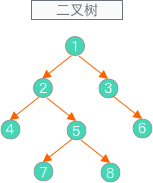

# 树

树其实是不包含回路的连通[无向图](../图/简介.md)。

树有如下特性：

- 一颗树中任意两个结点有且仅有唯一的一条路径连通；
- 如果有 `n` 个结点，那么一定存在 `n-1` 条边；
- 在树中加一条边将会构成一个回路；

## 树的分类


## 二叉树

二叉树是每个结点最多有两个子树的树结构。通常子树被称作“左子树”（left subtree）和“右子树”（right subtree）。

二叉树常被用于实现二叉查找树和二叉堆。[百度百科](https://baike.baidu.com/item/%E4%BA%8C%E5%8F%89%E6%A0%91)

二叉树是每个结点最多有两个子树的树结构。通常子树被称作“左子树”（left subtree）和“右子树”（right subtree）。

### 完全二叉树/满二叉树

完全二叉树：一棵深度为 `h` 的树，除 `h` 层外，其它各层的结点树都达到最大个数，第 `h` 层从右向左连续缺失若干个结点。

满二叉树：一棵深度为 `h` 其有 `2^h - 1` 结点的二叉树。

```bash
// 完全二叉树
     5
    | \
   4   6
 / \  |
1  2  3
```

```bash
// 满二叉树
     5
    | \
   4   6
 / \  | \
1  2  3  7
```

> 满二叉树是一种特殊的或者极其完美的完全二叉树。

### 二叉树的遍历

对于二叉树有广度遍历( Breadth first traversal)和深度遍历(Depth first traversal)。

深度遍历又分为:

- 前序遍历
- 中序遍历
- 后序遍历

广度遍历也叫层次遍历(Level order traversal )，一般情况下，广度遍历需要其它数据结构的支撑，比如队列(堆)。

#### 前序遍历 PreOrder-Traversal

初始化一个二叉树如下图：



前序遍历：根结点 ---> 左子树 ---> 右子树

```text
1 => 2 => 4 => 5 => 7 => 8 => 3 => 6
```

#### 中序遍历 InOrder-Traversal

中序遍历：左子树---> 根结点 ---> 右子树

```text
4 => 2 => 7 => 5 => 8 => 1 => 3 => 6
```

#### 后序遍历 PostOrder-Traversal

后序遍历：左子树 ---> 右子树 ---> 根结点

```text
4 => 7 => 8 => 5 => 2 => 6 => 3 => 1
```

#### 层次遍历 Level Order Tree Traversal

层次遍历：只需按层次遍历即可

```text
1 => 2 => 3 => 5 => 6 => 7 => 8
```

对二叉树的实现和遍历的代码实现请查看`二叉树的应用`

### 二叉搜索树 Binary Search Tree

详见[二叉树搜索树](./二叉树/二叉搜索树.md)

### 平衡树

### 线索二叉树 Threaded Binary Tree

在二叉树的结点上加上线索的二叉树称为线索二叉树，对二叉树以某种遍历方式（如先序、中序、后序或层次等）进行遍历，使其变为线索二叉树的过程称为**对二叉树进行线索化**。


## 堆

### 二叉堆

二叉堆又分为最小（大）堆：

- 最小（大）堆是一个完全二叉树，并且每个结点的值都小于（大于）或等于其左右孩子结点的值；
- **堆是为了实现优先队列而实现的一种数据结构，它不是面向查找操作的，因而在堆中查找一个结点需要进行遍历，其平均时间复杂度是 `O(n)`**

详见[二叉堆](/docs/树/堆/二叉堆.md)

## B 树

## 字典树

## ref

[堆和树有什么区别](https://www.zhihu.com/question/36134980)
[binary-search-tree](https://github.com/exercism/typescript/tree/master/exercises/binary-search-tree)

