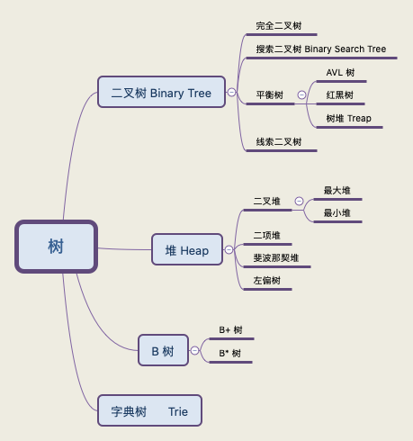

# 树

## 最小堆与二叉搜索树

二叉搜索树：

- 在二叉搜索树中，每个结点的值均大于其左子树上所有结点的值，小于其右子树上所有结点的值；
- 中序遍历二叉搜索树进行将得到一个有序序列；
- 　二叉排序树是为了实现动态查找而设计的数据结构，它是面向查找操作的，在二叉排序树中查找一个结点的平均时间复杂度是 `O(log n)`；

[binary-search-tree](/code/binary-tree/binary-search-tree.ts)

最小（大）堆：

- 最小（大）堆是一个完全二叉树，并且每个结点的值都小于（大于）或等于其左右孩子结点的值；
- 堆是为了实现优先队列而实现的一种数据结构，它不是面向查找操作的，因而在堆中查找一个结点需要进行遍历，其平均时间复杂度是 `O(n)`；

[min-heap](/code/heap/min-heap.ts)

## ref

[堆和树有什么区别](https://www.zhihu.com/question/36134980)
[binary-search-tree](https://github.com/exercism/typescript/tree/master/exercises/binary-search-tree)

